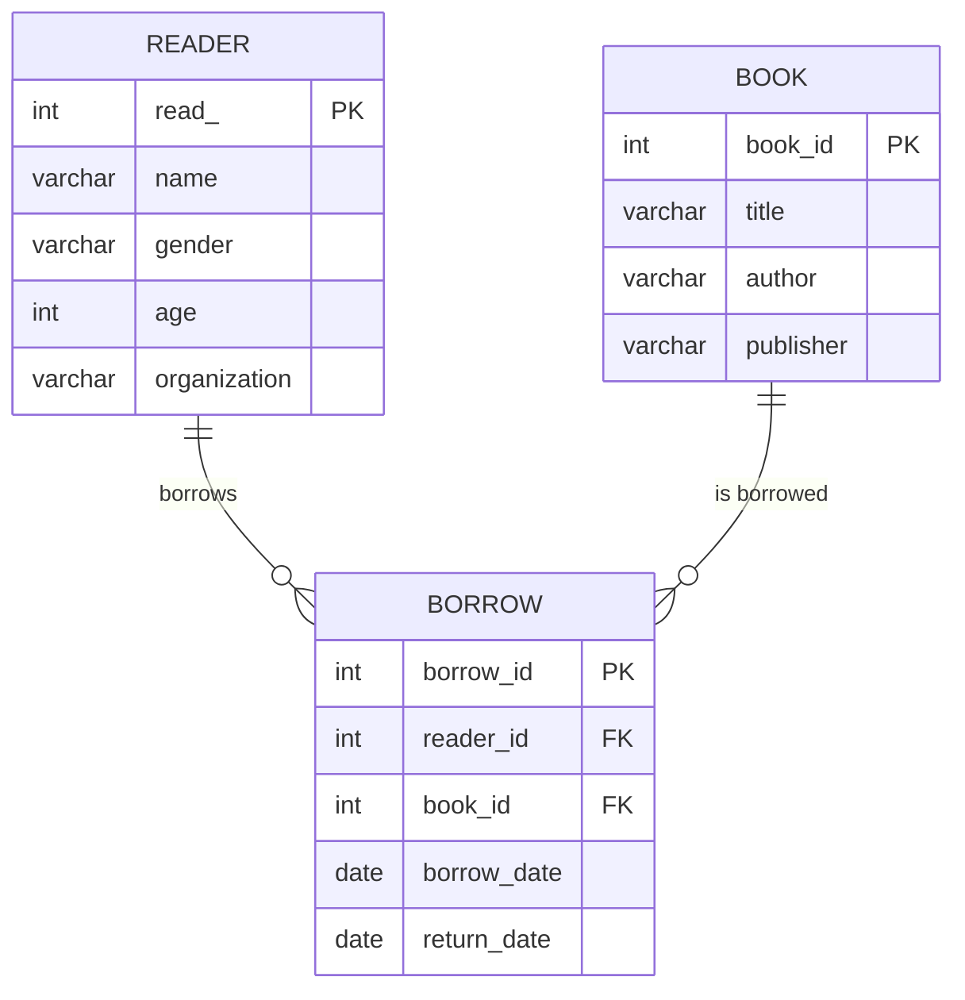

```mermaid
erDiagram
    READER {
        int read_ PK
        varchar name
        varchar gender
        int age
        varchar organization
    }

    BOOK {
        int book_id PK
        varchar title
        varchar author
        varchar publisher
    }

    BORROW {
        int borrow_id PK
        int reader_id FK
        int book_id FK
        date borrow_date
        date return_date
    }

    READER ||--o{ BORROW : "borrows"
    BOOK ||--o{ BORROW : "is borrowed"

```